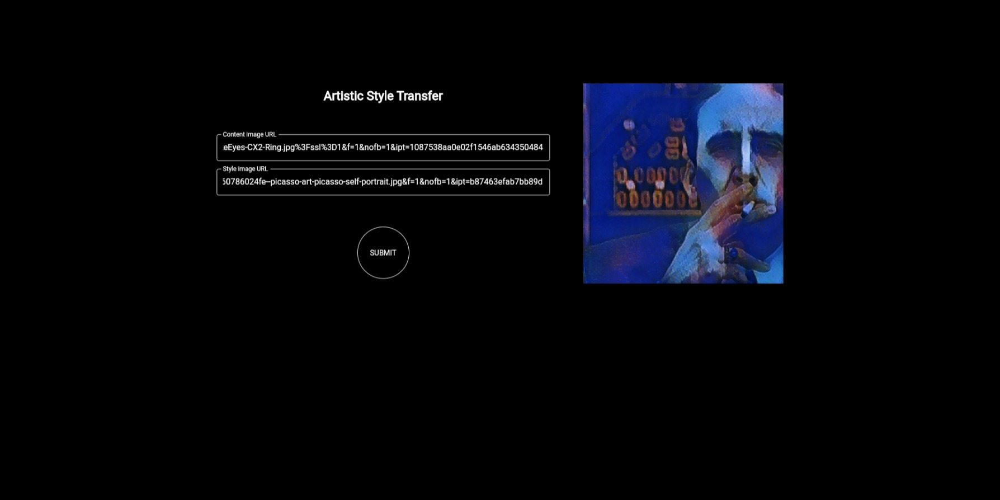

# Pastiche

### Artistic Style Transfer API
> A pastiche is a work of visual art, literature, theatre, music, or architecture that imitates the style or character of the work of one or more other artists.



### How to use it
Clone the repository
```
git clone https://github.com/arthursfares/pastiche.git
cd pastiche
``` 
Launch api server
```
uvicorn api.main:app --reload
```
Launch Flutter web application
```
flutter run app/lib/main.dart -d chrome
```

---

Made based on this [tutorial](https://www.tensorflow.org/lite/examples/style_transfer/overview) 〜(￣▽￣〜)